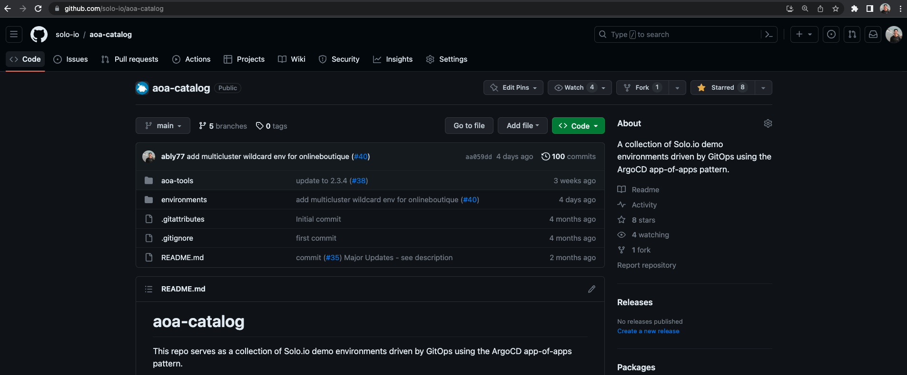

# aoa-catalog
This repo serves as a collection of Solo.io demo environments driven by GitOps using the ArgoCD app-of-apps pattern.

### Demo Video Link

[](https://youtu.be/c4wgigSihJI)

### Prerequisites
- `yq` - `brew install yq` or see here (https://mikefarah.gitbook.io/yq/v/v3.x/)
- `k3d` - `brew install k3d` or see here (https://k3d.io/v5.4.7/#installation)
- `kubectl` - `brew install kubectl` or see here (https://kubernetes.io/docs/tasks/tools/#kubectl)

#### Exporting your license key
For environments that require an Enterprise product license, export your license key with the commands below
```
export GLOO_LICENSE_KEY="<INSERT_LICENSE_KEY_HERE>"
export GLOO_PLATFORM_LICENSE_KEY="<INSERT_LICENSE_KEY_HERE>"
export LICENSE_KEY="<INSERT_LICENSE_KEY_HERE>"
```

#### Renaming Cluster Context
If your local clusters have a different context name, you will want to have it match the expected context name(s) (mgmt,cluster1,cluster2).
IE for the mgmt cluster
```
kubectl config rename-context k3d-your_mgmt_cluster_name mgmt
```

## To deploy
```
./aoa-tools/deploy.sh deploy -f <environment directory>
```

### Installer options
```
Syntax: installer [-f|-i|-h]

commands:
deploy     deploys an environment with the specified path
destroy    destroys an environment with the specified path

options:
-f     path to environment files
-i     install infra
-h     print help

additional flags:
--skip-argo  skip argo installation
```

Notes on flag options: 
- If `-i` is used, the installer will check for a folder named `.infra` in the environment directory and will install the infra before running the script. This currently only supports `k3d` for local deployments

### catalog.yaml
The `catalog.yaml` exists in each demo environment directory which provides a list of app-of-apps "waves" to be deployed in order by the installer. A wave consists of the `location` (relative to the root path of the selected environment) as well as `pre_deploy` and `post_deploy` scripts which can be optionally run which can be useful for tasks such as health checks, or waiting for pods to be ready or printing output.

Example sequence of events:
```
(Wave 1)
pre_deploy scripts > deploy app-of-app > post_deploy scripts
(Wave 2)
pre_deploy scripts > deploy app-of-app > post_deploy scripts
<...>
``````

#### Cloud Loadbalancer Discovery (alpha)
*Note:* This is only available on select `gloo-gateway` environments, but more will be added over time

Configuring the `catalog.yaml` to use the homer app `lb-discovery` overlay is useful in Cloud environments where wildcard hosts are used so that the homer dashboard links reflect the LB hostname or IP.
- Valid for: `core`, `onlineboutique`, `progressive-delivery-argo-rollouts`, and `solowallet`
- Environments where Ext Auth capabilities are demonstrated cannot also have homer-app `lb-discovery` due to IDP callback URLs. Use `glootest.com` overlay instead which uses a stable hostname. This applies to `gloo-gateway/bookinfo`, `gloo-gateway/httpbin`, and `gloo-gateway/int-ext-portal`.

An example `catalog.yaml` below shows an example where the default localhost `homer-app` commented out and the lb-discovery `homer-app` uncommented. The homer dashboard configuration is managed by the `pre_deploy` init script where the $LB_ADDRESS is discovered and injected
```
  # Uncomment to use localhost for link dashboard (k3d)
  #- name: homer-app
  #  location: $env_path/homer-app/localhost
  #  scripts:
  #    pre_deploy: 
  #    -  $env_path/homer-app/localhost/init.sh
  #    post_deploy:
  #    -  $env_path/homer-app/localhost/test.sh 
  # Uncomment to use LB Discovery for link dashboard (Cloud)
  - name: homer-app
    location: $env_path/homer-app/lb-discovery
    scripts:
      pre_deploy: 
      -  $env_path/homer-app/lb-discovery/init.sh
      post_deploy:
      -  $env_path/homer-app/lb-discovery/test.sh 
```

### vars.env
The `vars.env` exists in each demo environment directory with a few variables used in the installation such as inputting license keys, defining cluster contexts, and configuring app sync behavior. The installer will use any passed in flags and attempt to discover all of the necessary variables in the pre-check. Please verify the output before continuing.
```
license_key="$GLOO_PLATFORM_LICENSE_KEY"
cluster_context="mgmt"
parent_app_sync="true"
```

When `parent_app_sync="false"` the installer will disable ArgoCD `autosync` and `prune` features. This is particularly useful for development so manual changes using `kubectl` are not re-synced by ArgoCD.

#### k3d loadbalancer port mapping
K3d allows for exposing ports via docker and servicelb in local deployments. This provides local access to services with `type: LoadBalancer` in the browser at `localhost:<port>`. The k3d cluster config examples provided in the `.infra` folder are configured with the following mappings

* mgmt cluster port 80:80 and 443:443
* cluster1 cluster port 8080:80 and 8443:443
* cluster2 cluster port 8081:80 and 8444:443

#### using a private repo
ArgoCD makes it pretty easy to connect to a private repo. Prior to running the installer, provide the private repo and your github access token as a Kubernetes secret in the `argocd` namespace
```
apiVersion: v1
kind: Secret
metadata:
  name: first-repo
  namespace: argocd
  labels:
    argocd.argoproj.io/secret-type: repository
stringData:
  type: git
  url: https://github.com/solo-io/aoa-lib-private
---
apiVersion: v1
kind: Secret
metadata:
  name: private-repo-creds
  namespace: argocd
  labels:
    argocd.argoproj.io/secret-type: repo-creds
stringData:
  type: git
  url: https://github.com/solo-io
  # personal access token
  password: <access_token>
  username: solo-io
```
