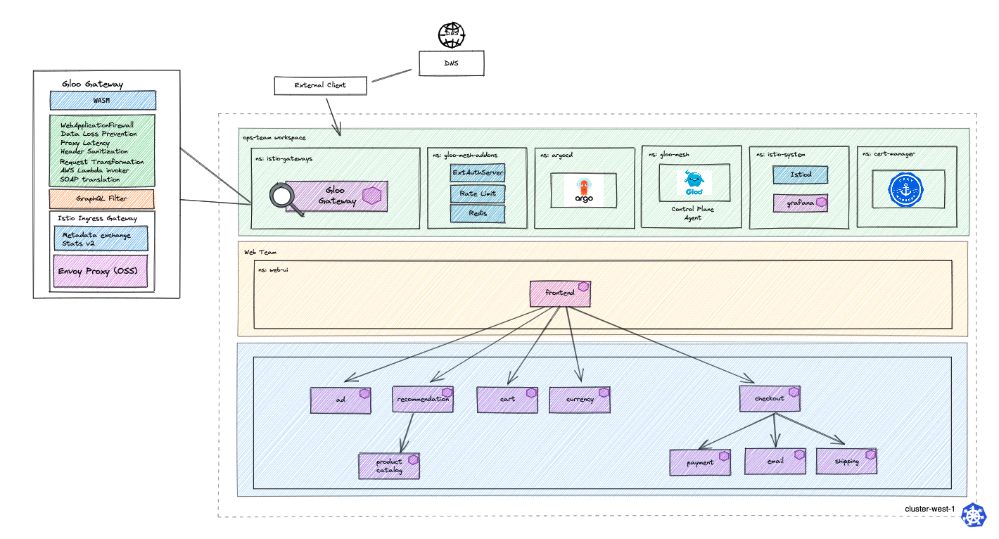

# Environment Description
The `gloo-gateway/otel/onlineboutique` environment deploys the core components of a single cluster Gloo Platform demo, without any applications deployed. This is a great starting ground to get a barebones demo setup where you can bring your own application example into the mesh.



### Prerequisites
- 1 Kubernetes Cluster
    - This demo has been tested on 1x `n2-standard-4` (gke), `m5.xlarge` (aws), or `Standard_DS3_v2` (azure) instance, and using K3d locally on M1 and Intel Macbook Pro
    - Kubernetes version 1.23 and 1.24

- Wave 1 - Configures cluster-config and namespaces
- Wave 2 - Deploys cert-manager
- Wave 3 - Deploys Gloo Mesh and register Agents
- Wave 4 - Deploys Istio and Ingress Gateway(s)
- Wave 5 - Configures initial Gloo Mesh components
    - Set up `ops-team` workspace
    - Configure Gateway on 443
    - Configure Gloo Mesh addons
    - expose Gloo Mesh UI
    - expose ArgoCD UI
- Wave 6 - Deploys Online Boutique Application
- Wave 6 - Configures Online Boutique Mesh Config

## Overlay description
- base:
    - gloo mesh 2.2.4
    - istio 1.16.2-solo (Helm)
    - revision: 1-16
- ilcm:
    - gloo mesh 2.2.4
    - istio 1.16.2-solo (ILCM)
    - revision: 1-16

## Application description

The RouteTables for applications exposed in this demo are defining non-wildcard hosts which follow the pattern `<app>-local.glootest.com`. You can map these hostnames to your gateway IP address in your DNS service of choice (i.e. Route53, Cloudflare), or you can follow the methods below to modify your `/etc/hosts` locally depending on your cluster LoadBalancer configuration.

Applications Exposed using this demo:
- ArgoCD at `https://argocd-local.glootest.com/argo`
    - argocd credentials:
    - user: admin
    - password: solo.io
- Gloo Mesh UI at `https://gmui-local.glootest.com`
- Online Boutique at `https://shop-local.glootest.com`

To access applications, follow the methods below:

#### Method 1 - LoadBalancer External-IP

Discover your gateway IP address
```
ISTIO_REVISION=1-16
GATEWAY_IP=$(kubectl -n istio-gateways get service istio-ingressgateway-${ISTIO_REVISION} -o jsonpath='{.status.loadBalancer.ingress[0].ip}')

echo ${GATEWAY_IP}
```

Modify /etc/hosts on your local machine (this will require sudo privileges), or configure DNS to point to your Ingress Gateway IP
```
cat <<EOF | sudo tee -a /etc/hosts
${GATEWAY_IP} argocd-local.glootest.com gmui-local.glootest.com shop-local.glootest.com
EOF
```

#### Method 2 - K3d LB Integration
modify /etc/hosts on your local machine (this will require sudo privileges)
```
cat <<EOF | sudo tee -a /etc/hosts
127.0.0.1 argocd-local.glootest.com gmui-local.glootest.com shop-local.glootest.com
EOF
```

#### Method 3: use port-forwarding

To access argocd using port-forward command:
```
kubectl port-forward svc/argocd-server -n argocd 9999:443 --context <cluster_name>
```
access argocd at https://localhost:9999/argo


To access gloo mesh ui using port-forward command:
```
kubectl port-forward -n gloo-mesh svc/gloo-mesh-ui 8090 --context <cluster_name>
```
access gloo mesh ui at https://localhost:8090"


To access Istio Ingress Gateway using port-forward command:
```
ISTIO_REVISION=1-16
kubectl port-forward -n istio-gateways svc/istio-ingressgateway-${ISTIO_REVISION} 8443:443 --context <cluster_name>
```
access the ingress gateway at https://localhost:8443


Note: For routes that are configured with a specific host, pass in the Host header using curl `-H "Host: <host>` or add the following entry into your /etc/hosts when using this method
```
cat <<EOF | sudo tee -a /etc/hosts
127.0.0.1 argocd-local.glootest.com gmui-local.glootest.com shop-local.glootest.com
EOF
```