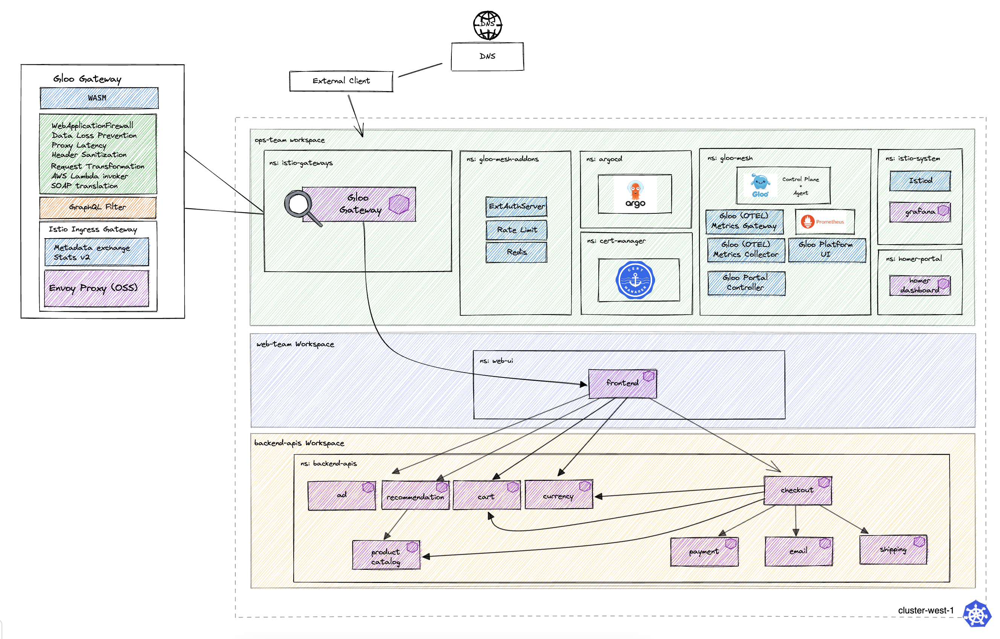

# Environment Description
The `gloo-gateway/onlineboutique` environment deploys the core components of a single cluster Gloo Platform demo, with the onlineboutique application deployed and exposed by Gloo Gateway

### Prerequisites
- 1 Kubernetes Cluster
    - This demo has been tested on 1x `n2-standard-4` (gke), `m5.xlarge` (aws), or `Standard_DS3_v2` (azure) instance, and using K3d locally on M1 and Intel Macbook Pro
    - Kubernetes version 1.23-1.28

## Environment descriptions
- base:
    - gloo mesh 2.6.6
    - istio 1.23.0-solo (Helm)
    - revision: 1-23