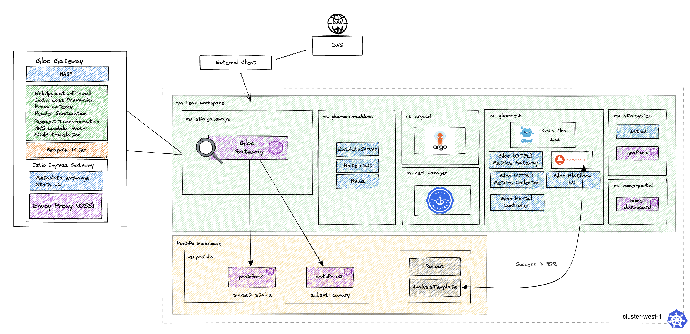

# Environment Description
The `gloo-gateway/progressive-delivery-argo-rollouts` environment deploys the core components of a single cluster Gloo Platform demo, Argo Rollouts, and a Podinfo application Rollout. This environment can be used to demonstrate Progressive Delivery with GitOps using ArgoCD + Argo Rollouts + Gloo Platform + Istio

### Prerequisites
- 1 Kubernetes Cluster
    - This demo has been tested on 1x `n2-standard-4` (gke), `m5.xlarge` (aws), or `Standard_DS3_v2` (azure) instance, and using K3d locally on M1 and Intel Macbook Pro
    - Kubernetes version 1.23-1.28

## Environment descriptions
- base:
    - gloo mesh 2.6.9
    - istio 1.24.2-solo (Helm)
    - revision: main