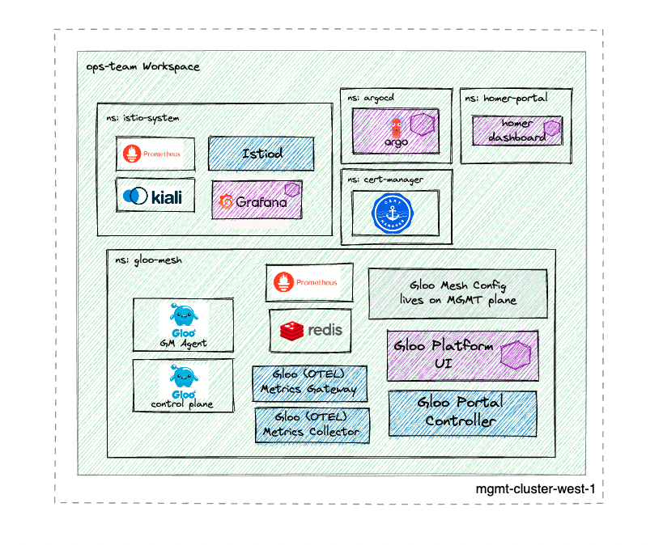
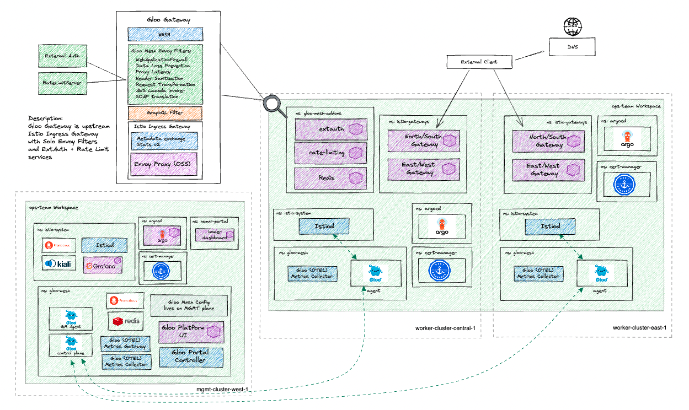

# Environment Description
The `gloo-platform/core/mgmt` environment deploys the mgmt cluster control plane for a multi-cluster Gloo Platform demo, with Istio exposing admin applications on the cluster. This environment can be used in conjunction with `gloo-platform/core/cluster1` and `gloo-platform/core/cluster2` to demonstrate cluster onboarding, secure cross-cluster communication, failover, and other mesh-focused use cases

### What this deploys
When applied alone, the control plane is deployed and configured with just the `ops-team` workspace.

### Multi-Cluster Architecture Diagram
When applied with `cluster1` and `cluster2` environments, here is a high level diagram of the architecture

### Prerequisites
- 1 Kubernetes Cluster
    - This demo has been tested on 1x `n2-standard-4` (gke), `m5.xlarge` (aws), or `Standard_DS3_v2` (azure) instance, and using K3d locally on M1 and Intel Macbook Pro
    - Kubernetes version 1.23-1.28

## Environment description
- base:
    - gloo mesh 2.6.6
    - istio 1.24.0-solo (Helm)
    - revision: 1-24