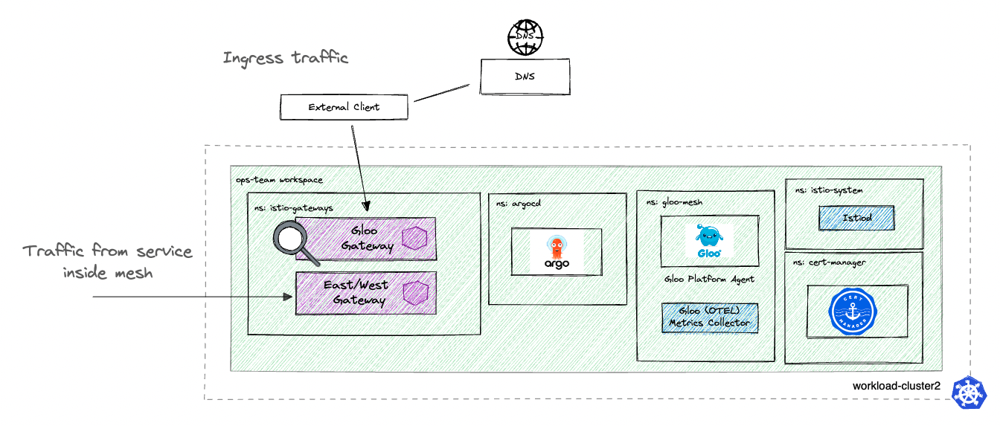

# Environment Description
The `gloo-platform/core/cluster2` environment deploys the `cluster2` worker for a multi-cluster Gloo Platform demo, which deploys Istio with ingress gateways and configures the Gloo Mesh Agent to communicate with the Gloo Mesh Control Plane served by the `gloo-platform/core/mgmt` environment

### Prerequisites
- 1 Kubernetes Cluster
    - This demo has been tested on 1x `n2-standard-4` (gke), `m5.xlarge` (aws), or `Standard_DS3_v2` (azure) instance, and using K3d locally on M1 and Intel Macbook Pro
    - Kubernetes version 1.23-1.28

## Environment description
- base:
    - gloo mesh 2.6.9
    - istio 1.24.2-solo (Helm)
    - revision: main