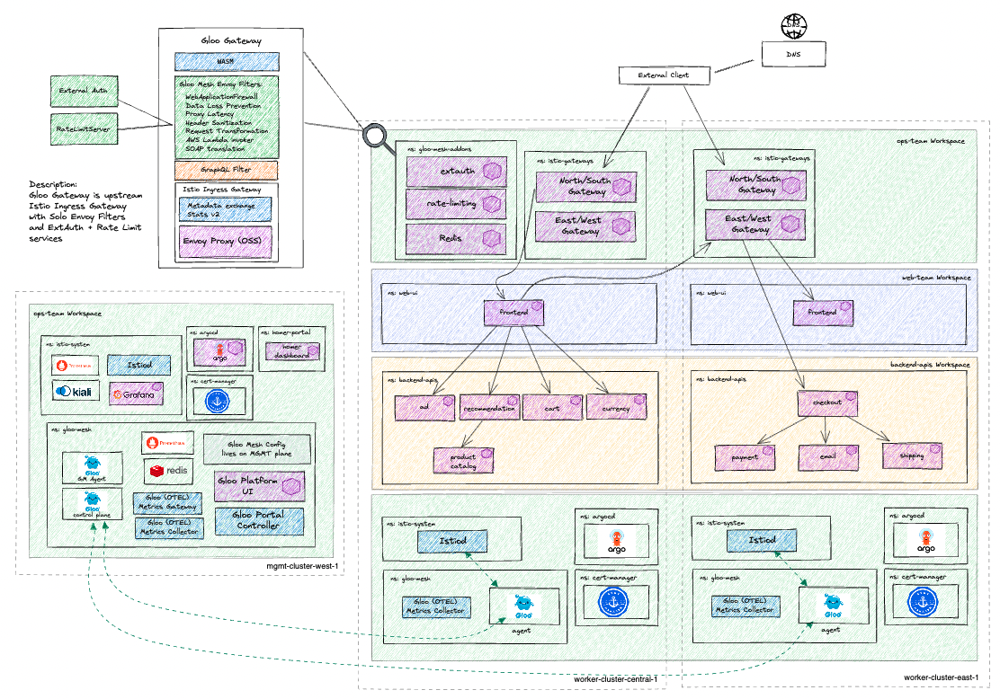

# Environment Description
The `gloo-platform/multicluster-onlineboutique/cluster2` environment deploys the `cluster2` worker for a multi-cluster Gloo Platform demo, which deploys Istio with ingress gateways, Bookinfo, httpbin, and configures the Gloo Mesh Agent to communicate with the Gloo Mesh Control Plane served by the `multicluster-onlineboutique/mgmt` environment

